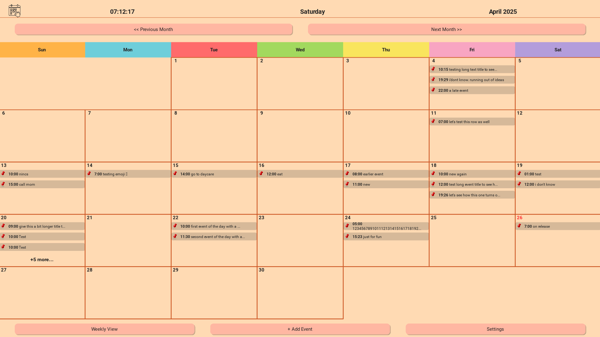
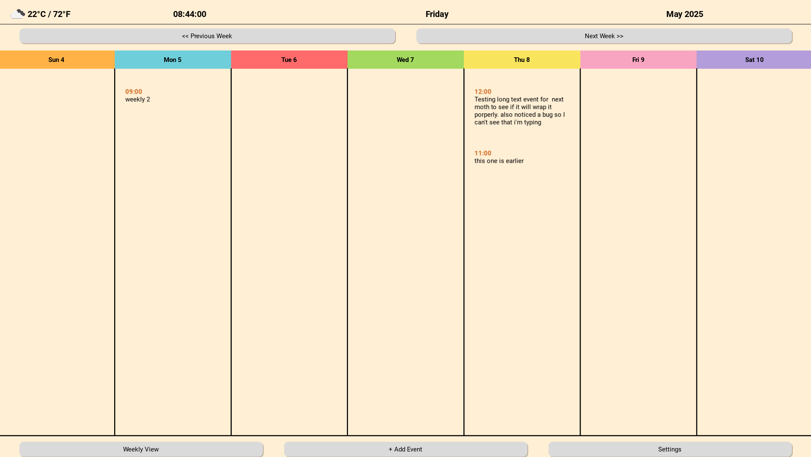

# 🗓️ Raspberry Pi Touchscreen Schedule Board

A lightweight, standalone scheduling board built with **Python**, **Kivy**, and **SQLite (via SQLAlchemy)**, designed for a Raspberry Pi connected to a touchscreen. The app displays monthly and weekly calendar views with tap-to-edit events, optimized for visibility and finger input. Events sync two-way with **iCloud Calendar** on your iPhone via CalDAV.

Great for home offices, studios, family schedules, or small business front desks.

---

## 🚀 Features

- 📆 **Monthly and weekly calendar views** with tap-to-edit daily events
- 📱 **Touchscreen-optimized UI** using Kivy (large buttons, clean layout)
- 💾 **Persistent event storage** via SQLite and SQLAlchemy ORM
- 🔄 **iCloud Calendar sync** — events added on the Pi appear on your iPhone and vice versa
- 🌗 **Themed UI** with automatic light/dark switching
- 🌤️ **Weather display** via OpenWeatherMap
- 🤖 **AI calendar agent** (optional) — natural-language event management via FastAPI
- ⚡ **Auto-start on boot** for kiosk-style use on Raspberry Pi

---

## 📸 Screenshot



> _Full-screen calendar on a Raspberry Pi touchscreen with highlighted dates and event popups._

---

## 🧱 Tech Stack

| Layer       | Tech                             |
|-------------|----------------------------------|
| UI          | [Kivy](https://kivy.org/)        |
| Database    | SQLite via [SQLAlchemy](https://www.sqlalchemy.org/) |
| iCloud sync | [caldav](https://github.com/python-caldav/caldav) + [icalendar](https://icalendar.readthedocs.io/) |
| Agent API   | [FastAPI](https://fastapi.tiangolo.com/) + LangChain (optional) |
| Hardware    | Raspberry Pi 4/5 + Touchscreen   |
| Language    | Python 3                         |

---

## 🏗️ File Structure

```
EventCalendar/
├── main.py                    # Kivy app entry point
├── calendar.db                # SQLite DB (auto-generated)
├── requirements.txt
├── .env.example               # Environment variable template
├── app/                       # Theme manager, weather, sync runner
├── UI/                        # Calendar views, popups, components
├── storage/                   # SQLAlchemy models, CRUD, migrations
│   ├── db_manager.py
│   └── migration.py           # Adds iCal/sync columns to existing DBs
├── sync/                      # iCloud CalDAV sync
│   ├── icloud_sync.py         # Connection test / fetch preview
│   ├── ical_mapper.py         # iCal ↔ Event field mapping
│   ├── sync_job.py            # Full pull / push / delete sync
│   └── sync_state.json        # Last sync result (auto-generated)
├── agent_service/             # Optional FastAPI AI agent
├── deploy/systemd/            # Daily sync timer unit files
└── assets/                    # Images, fonts, icons
```

---

## ⚙️ Setup Instructions

### 📦 Prerequisites

- Raspberry Pi OS (Lite or Full) or any Linux/macOS machine for development
- Python 3.8+
- An Apple ID with iCloud Calendar enabled

### 🛠 Installation

```bash
git clone https://github.com/bordanattila/EventCalendar.git
cd EventCalendar
```

Create and activate a virtual environment:

```bash
python3 -m venv .venv
source .venv/bin/activate
```

Install dependencies:

```bash
pip install --upgrade pip
pip install -r requirements.txt
```

Configure environment variables:

```bash
cp .env.example .env
# Edit .env with your API keys and iCloud credentials (see below)
```

If you have an existing `calendar.db`, run the migration to add sync columns:

```bash
python storage/migration.py
```

Run the app:

```bash
python main.py
```

---

## 🔄 iCloud Calendar Sync

Sync keeps your Pi calendar and a chosen iCloud calendar in sync. Changes made on the touchscreen are pushed to iCloud; events created or edited on your iPhone are pulled down on the next sync.

### 1. Create an app-specific password

Apple requires an app-specific password for CalDAV access (not your regular Apple ID password):

1. Go to [appleid.apple.com](https://appleid.apple.com) → **Sign-In and Security** → **App-Specific Passwords**
2. Generate a password (e.g. "EventCalendar Pi")
3. Add it to `.env`:

```env
ICLOUD_APPLE_ID=your@email.com
ICLOUD_APP_PASSWORD=xxxx-xxxx-xxxx-xxxx
ICLOUD_CALENDAR_NAME=Family
DEFAULT_TIMEZONE=America/New_York
```

`ICLOUD_CALENDAR_NAME` must match the calendar name as shown in the iOS Calendar app. If multiple calendars share the same name, set `ICLOUD_CALENDAR_URL` to the specific CalDAV URL instead (see `.env.example`).

### 2. Test the connection

Preview today's events from iCloud:

```bash
python sync/icloud_sync.py
```

Fetch series masters (for debugging recurrence mapping):

```bash
python sync/icloud_sync.py --masters --verbose
```

### 3. Run a full sync manually

```bash
python sync/sync_job.py
```

Individual steps:

```bash
python sync/sync_job.py --pull-only    # iCloud → calendar.db
python sync/sync_job.py --push-only    # calendar.db → iCloud
python sync/sync_job.py --delete-only  # Remove deleted events on both sides
```

### 4. Sync from the touchscreen

Open **Settings** in the app and tap **Sync Now**. The last sync time is shown below the button. The calendar view refreshes automatically after a background sync completes.

### 5. Schedule daily sync (Raspberry Pi)

Copy the systemd unit files and adjust paths for your install:

```bash
sudo cp deploy/systemd/eventcalendar-sync.service /etc/systemd/system/
sudo cp deploy/systemd/eventcalendar-sync.timer /etc/systemd/system/
# Edit User, WorkingDirectory, and ExecStart paths in the service file
sudo systemctl daemon-reload
sudo systemctl enable --now eventcalendar-sync.timer
```

This runs a full sync every day at 6:00 AM. Check status with:

```bash
systemctl status eventcalendar-sync.timer
journalctl -u eventcalendar-sync.service
```

### How sync works

| Direction | Behavior |
|-----------|----------|
| **Pull** | Fetches events from iCloud and inserts or updates rows in `calendar.db` |
| **Push** | Sends local events marked `pending_push` to iCloud |
| **Delete** | Removes events deleted on either side |

Each event stores an `ical_uid` and `ical_etag` for stable identity and change detection. Conflicts are resolved with last-write-wins; details are logged to `sync/sync.log`.

Recurrence (`daily`, `weekly`, `monthly`, `yearly`) is mapped to and from iCal `RRULE` in both directions.

---

## 🤖 AI Agent Service (Optional)

The `agent_service/` directory contains a FastAPI service that manages the same `calendar.db` using natural language. See [agent_service/README.md](./agent_service/README.md) for setup.

Sync can also be triggered via the agent API:

```bash
# Check last sync status
curl http://localhost:8000/sync/status

# Run a full sync
curl -X POST http://localhost:8000/sync
```

---

## 🔁 Auto-Start on Boot (Optional)

To launch the Kivy app on boot:

```bash
nano ~/.config/lxsession/LXDE-pi/autostart
```

Add:

```
@/usr/bin/python3 /home/pi/EventCalendar/main.py
```

---

## 🌟 Roadmap

- ✅ Themed UI (light, dark, custom)
- ✅ Weekly calendar view
- ✅ iCloud Calendar sync (CalDAV, two-way)
- ✅ Natural language input via AI agent
- 🔔 Event reminders / notifications
- 🔄 Google Calendar sync (OAuth)

---

## 📜 License

MIT License — use it, fork it, build on it.

---

## 🤘 Author

Attila Bordán

Engineer. Builder.

[LinkedIn](https://www.linkedin.com/in/bordanattila/)  
[Portfolio](https://bordanattila.github.io/Portfolio/)
