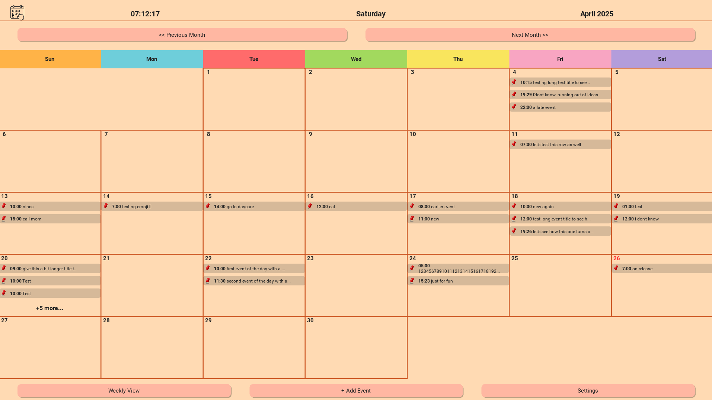

# 🗓️ Raspberry Pi Touchscreen Schedule Board

A lightweight, standalone scheduling board built with **Python**, **Kivy**, and **SQLite (via SQLAlchemy)**, designed for a Raspberry Pi connected to a touchscreen. The app displays a monthly calendar view with tap-to-edit events, optimized for visibility and finger input. Great for home offices, studios, family schedules, or small business front desks.

---

## 🚀 Features

- 📆 **Monthly calendar view** with tap-to-edit daily events
- 📱 **Touchscreen-optimized UI** using Kivy (large buttons, clean layout)
- 💾 **Persistent event storage** via SQLite and SQLAlchemy ORM
- ⚡ **Auto-start on boot** for kiosk-style use on Raspberry Pi
- 🌙 Future enhancements planned: theming, syncing, notification support

---

## 📸 Screenshot

  
> _Full-screen calendar on a Raspberry Pi touchscreen with highlighted dates and event popups._

---

## 🧱 Tech Stack

| Layer       | Tech                             |
|-------------|----------------------------------|
| UI          | [Kivy](https://kivy.org/)        |
| Database    | SQLite via [SQLAlchemy](https://www.sqlalchemy.org/) |
| Hardware    | Raspberry Pi 4/5 + Touchscreen   |
| Language    | Python 3                         |

---

## 🏗️ File Structure
```
EventCalendar/
├── main.py                # Entry point
├── /app/                  # Theme manager, utils, API logic
├── /ui/                   # Calendar view and popup components
├── /storage/              # DB connection and queries
├── /assets/               # Images, fonts, icons
├── README.md
├── requirements.txt
└── calendar.db            # SQLite DB (auto-generated)
```

---

## ⚙️ Setup Instructions

### 📦 Prerequisites
- Raspberry Pi OS (Lite or Full)
- Python 3.8+
- Kivy installed (`pip install kivy`)
- SQLAlchemy installed (`pip install sqlalchemy`)

### 🛠 Installation

```commandline
git clone https://github.com/bordanattila/EventCalendar.git
cd EventCalendar
```
Create & activate a virtual environment
```commandline
python3 -m venv .venv
source .venv/bin/activate

```
Install dependencies
```commandline
pip install --upgrade pip
pip install -r requirements.txt
```
Run the app
```commandline
python main.py
```

🔁 Auto-Start on Boot (Optional)
To launch on boot:
```commandline
nano ~/.config/lxsession/LXDE-pi/autostart
```
Add:
```commandline
@/usr/bin/python3 /home/pi/EventCalendar/main.py
```

---
🌟 Roadmap
✅ Themed UI (light, dark, custom)

✅ Weekly calendar view

🔄 Google Calendar sync (OAuth)

🔔 Event reminders / notifications

🧠 Natural language input (“Lunch with Sarah at 2PM”)

🌐 Web-based sync dashboard (maybe with Flask or FastAPI)
---
📜 License
MIT License — use it, fork it, build on it.
---
🤘 Author
Attila Bordán

Engineer. Builder. 

[LinkedIn](https://www.linkedin.com/in/bordanattila/)  
[Portfolio](https://bordanattila.github.io/Portfolio/)
---
